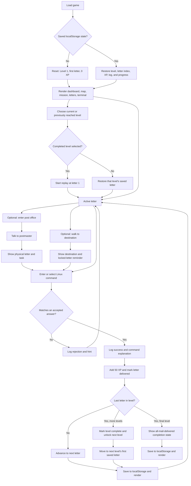
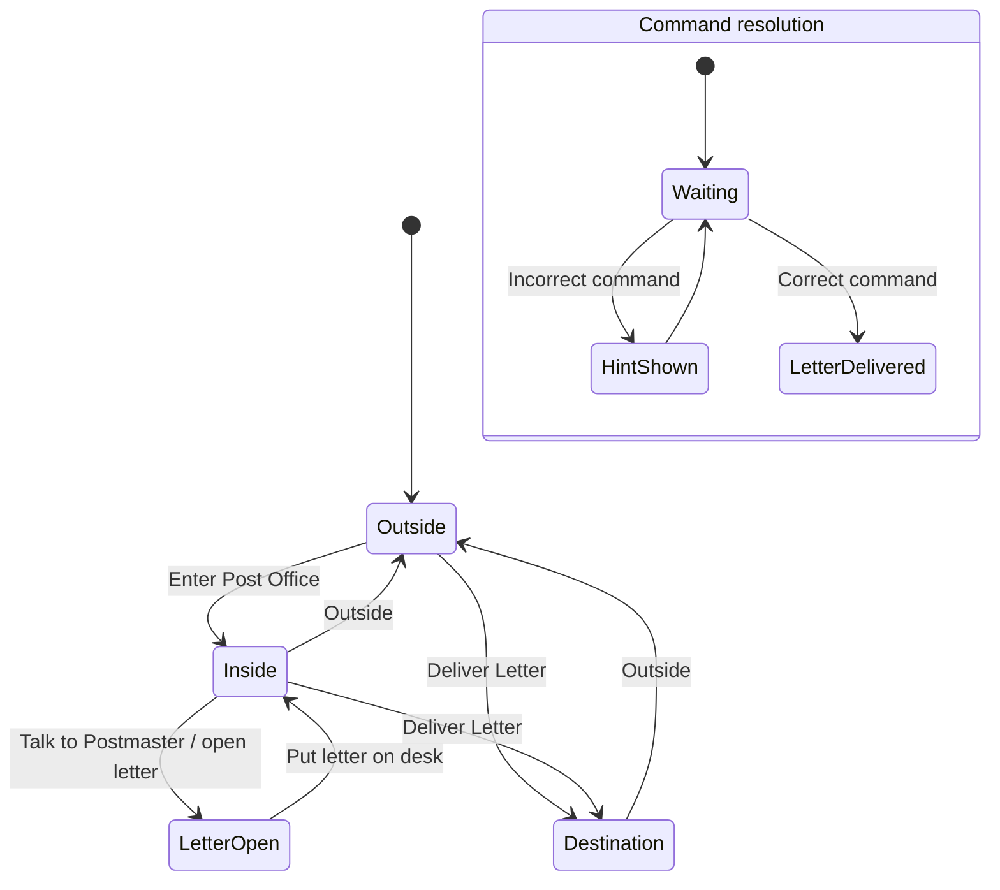

# Linux Post Office — Current Game Flow

This diagram documents the flow implemented in `linux_post_office 2.html`.

```mermaid
flowchart TD
    A[Load game] --> B{Saved localStorage state?}
    B -- No --> C[Reset: Level 1, first letter, 0 XP]
    B -- Yes --> D[Restore level, letter index, XP, log, and progress]
    C --> E[Render dashboard, map, mission, letters, terminal]
    D --> E

    E --> F[Choose current or previously reached level]
    F --> G{Completed level selected?}
    G -- Yes --> H[Start replay at letter 1]
    G -- No --> I[Restore that level's saved letter]
    H --> J[Active letter]
    I --> J
    E --> J

    J --> K[Optional: enter post office]
    K --> L[Talk to postmaster]
    L --> M[Show physical letter and task]
    J --> N[Optional: walk to destination]
    N --> O[Show destination and locked-letter reminder]
    M --> P[Enter or select Linux command]
    O --> P
    J --> P

    P --> Q{Matches an accepted answer?}
    Q -- No --> R[Log rejection and hint]
    R --> J
    Q -- Yes --> S[Log success and command explanation]
    S --> T[Add 50 XP and mark letter delivered]
    T --> U{Last letter in level?}
    U -- No --> V[Advance to next letter]
    V --> W[Save to localStorage and render]
    W --> J
    U -- Yes, more levels --> X[Mark level complete and unlock next level]
    X --> Y[Move to next level's first saved letter]
    Y --> W
    U -- Yes, final level --> Z[Show all-mail-delivered completion state]
    Z --> AA[Save to localStorage and render]
```

## State model

```mermaid
stateDiagram-v2
    [*] --> Outside
    Outside --> Inside: Enter Post Office
    Inside --> LetterOpen: Talk to Postmaster / open letter
    LetterOpen --> Inside: Put letter on desk
    Outside --> Destination: Deliver Letter
    Inside --> Destination: Deliver Letter
    Destination --> Outside: Outside
    Inside --> Outside: Outside

    state "Command resolution" as Command {
        [*] --> Waiting
        Waiting --> HintShown: Incorrect command
        HintShown --> Waiting
        Waiting --> LetterDelivered: Correct command
    }
```
